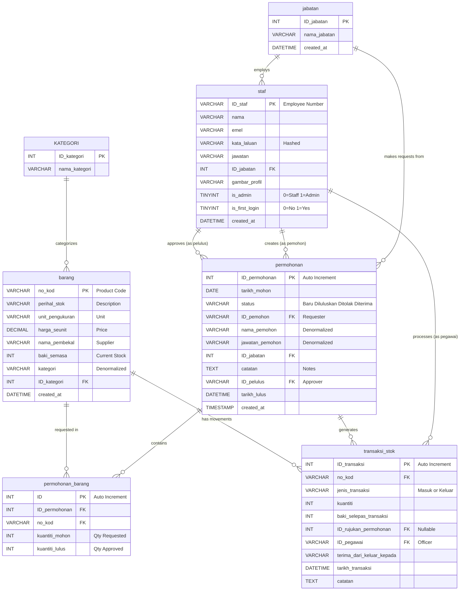

# Entity Relationship Diagram (ERD)
## Sistem Pengurusan Bilik Stor dan Inventori MPK

---

## Database Tables Overview

### 1. **staf** (Staff/User)
Primary table for all system users (both staff and admin)

**Columns:**
- `ID_staf` (VARCHAR) - PRIMARY KEY - Staff ID / Employee Number
- `nama` (VARCHAR) - Full name
- `emel` (VARCHAR) - Email address
- `kata_laluan` (VARCHAR) - Hashed password
- `jawatan` (VARCHAR) - Position/Job title
- `ID_jabatan` (INT) - FOREIGN KEY → jabatan.ID_jabatan
- `gambar_profil` (VARCHAR) - Profile picture path
- `is_admin` (TINYINT) - Role indicator: 0=Staff, 1=Admin
- `is_first_login` (TINYINT) - First login flag: 0=No, 1=Yes
- `created_at` (DATETIME) - Account creation timestamp

**Relationships:**
- One staff belongs to ONE department (jabatan)
- One staff can make MANY requests (permohonan)

---

### 2. **jabatan** (Department/Unit)
Organizational departments within MPK

**Columns:**
- `ID_jabatan` (INT) - PRIMARY KEY - Department ID
- `nama_jabatan` (VARCHAR) - Department name
- `created_at` (DATETIME) - Record creation timestamp

**Relationships:**
- One department has MANY staff members
- One department can have MANY requests

---

### 3. **barang** (Products/Items/Stock)
Inventory items available in the storeroom

**Columns:**
- `no_kod` (VARCHAR) - PRIMARY KEY - Product code/SKU
- `perihal_stok` (VARCHAR) - Product description/name
- `unit_pengukuran` (VARCHAR) - Unit of measurement (e.g., "unit", "kotak", "rim")
- `harga_seunit` (DECIMAL) - Price per unit
- `nama_pembekal` (VARCHAR) - Supplier name
- `baki_semasa` (INT) - Current stock balance
- `kategori` (VARCHAR) - Product category
- `ID_kategori` (INT) - FOREIGN KEY → KATEGORI.ID_kategori (if using category table)
- `created_at` (DATETIME) - Record creation timestamp

**Relationships:**
- One product can appear in MANY request items (permohonan_barang)
- One product can have MANY stock movement records

---

### 4. **KATEGORI** (Category)
Product categories for organization

**Columns:**
- `ID_kategori` (INT) - PRIMARY KEY - Category ID
- `nama_kategori` (VARCHAR) - Category name

**Relationships:**
- One category has MANY products (barang)

---

### 5. **permohonan** (Stock Requests)
Header table for stock requests (KEW.PS-8 form)

**Columns:**
- `ID_permohonan` (INT) - PRIMARY KEY AUTO_INCREMENT - Request ID
- `tarikh_mohon` (DATE) - Request date
- `status` (VARCHAR: 'Baru', 'Diluluskan', 'Ditolak', 'Diterima') - Request status
- `ID_pemohon` (VARCHAR) - FOREIGN KEY → staf.ID_staf - Requester ID
- `nama_pemohon` (VARCHAR) - Requester name (denormalized for history)
- `jawatan_pemohon` (VARCHAR) - Requester position (denormalized for history)
- `ID_jabatan` (INT) - FOREIGN KEY → jabatan.ID_jabatan - Department ID
- `catatan` (TEXT) - Notes/remarks
- `ID_pelulus` (VARCHAR) - FOREIGN KEY → staf.ID_staf - Approver ID
- `tarikh_lulus` (DATETIME) - Approval/rejection datetime
- `created_at` (TIMESTAMP) - Record creation timestamp

**Relationships:**
- One request belongs to ONE staff (pemohon/requester)
- One request belongs to ONE department
- One request has MANY request items (permohonan_barang)
- One request can be approved by ONE admin (pelulus/approver)

---

### 6. **permohonan_barang** (Request Items/Details)
Detail table for requested items (many-to-many junction table)

**Columns:**
- `ID` (INT) - PRIMARY KEY AUTO_INCREMENT - Request item ID
- `ID_permohonan` (INT) - FOREIGN KEY → permohonan.ID_permohonan - Request ID
- `no_kod` (VARCHAR) - FOREIGN KEY → barang.no_kod - Product code
- `kuantiti_mohon` (INT) - Quantity requested
- `kuantiti_lulus` (INT) - Quantity approved (default 0)

**Relationships:**
- Many request items belong to ONE request (permohonan)
- Many request items reference ONE product (barang)
- **JUNCTION TABLE** linking permohonan ↔ barang (Many-to-Many)

---

### 7. **transaksi_stok** (Stock Transaction Log)
Audit trail for all stock movements (in/out)

**Columns:**
- `ID_transaksi` (INT) - PRIMARY KEY AUTO_INCREMENT - Transaction ID
- `no_kod` (VARCHAR) - FOREIGN KEY → barang.no_kod - Product code
- `jenis_transaksi` (VARCHAR: 'Masuk', 'Keluar') - Transaction type (In/Out)
- `kuantiti` (INT) - Quantity moved
- `baki_selepas_transaksi` (INT) - Balance after transaction
- `ID_rujukan_permohonan` (INT) - FOREIGN KEY → permohonan.ID_permohonan (nullable) - Related request
- `ID_pegawai` (VARCHAR) - FOREIGN KEY → staf.ID_staf - Officer who processed
- `terima_dari_keluar_kepada` (VARCHAR) - Department/unit reference
- `tarikh_transaksi` (DATETIME) - Transaction datetime
- `catatan` (TEXT) - Transaction notes

**Relationships:**
- One transaction references ONE product (barang)
- One transaction may reference ONE request (optional for manual adjustments)
- One transaction is processed by ONE officer (staf)

---

## ERD Diagram (Mermaid Syntax)



---

## Relationship Summary

### **1:N (One-to-Many) Relationships:**

1. **jabatan → staf** (1:N)
   - One department employs many staff members
   - FK: `staf.ID_jabatan` → `jabatan.ID_jabatan`

2. **jabatan → permohonan** (1:N)
   - One department makes many requests
   - FK: `permohonan.ID_jabatan` → `jabatan.ID_jabatan`

3. **staf → permohonan (as pemohon)** (1:N)
   - One staff member creates many requests
   - FK: `permohonan.ID_pemohon` → `staf.ID_staf`

4. **staf → permohonan (as pelulus)** (1:N)
   - One admin approves many requests
   - FK: `permohonan.ID_pelulus` → `staf.ID_staf`

5. **permohonan → permohonan_barang** (1:N)
   - One request contains many items
   - FK: `permohonan_barang.ID_permohonan` → `permohonan.ID_permohonan`

6. **barang → permohonan_barang** (1:N)
   - One product appears in many request items
   - FK: `permohonan_barang.no_kod` → `barang.no_kod`

7. **KATEGORI → barang** (1:N)
   - One category contains many products
   - FK: `barang.ID_kategori` → `KATEGORI.ID_kategori`

8. **barang → transaksi_stok** (1:N)
   - One product has many stock movement records
   - FK: `transaksi_stok.no_kod` → `barang.no_kod`

9. **permohonan → transaksi_stok** (1:N)
   - One request generates many stock transactions (optional relationship)
   - FK: `transaksi_stok.ID_rujukan_permohonan` → `permohonan.ID_permohonan` (nullable)

10. **staf → transaksi_stok (as pegawai)** (1:N)
   - One officer processes many stock transactions
   - FK: `transaksi_stok.ID_pegawai` → `staf.ID_staf`

### **M:N (Many-to-Many) Relationships:**

1. **permohonan ↔ barang** (M:N)
   - Junction table: `permohonan_barang`
   - One request can have many products
   - One product can be in many requests
   - FKs:
     - `permohonan_barang.ID_permohonan` → `permohonan.ID_permohonan`
     - `permohonan_barang.no_kod` → `barang.no_kod`

---

## Database Normalization

**Current Form: 2NF (Second Normal Form)**

### Why 2NF?
- ✅ All non-key attributes depend on the primary key
- ✅ No partial dependencies exist
- ⚠️ Some denormalization exists (nama_pemohon, jawatan_pemohon stored in permohonan)

### Denormalization Reasons:
- **Historical Data Preservation**: Stores requester's name/position at time of request
- **Performance**: Avoids joins when displaying request history
- **Data Integrity**: Preserves original request details even if staff record changes

### Could be 3NF if:
- Remove `nama_pemohon`, `jawatan_pemohon` from `permohonan` (always JOIN with staf)
- Remove `nama_pelulus`, `jawatan_pelulus` from `permohonan` (always JOIN with staf)
- **Trade-off**: Performance vs strict normalization

---

## Cardinality Notation

```
jabatan (1) ──────< (N) staf
jabatan (1) ──────< (N) permohonan
staf (1) ──────< (N) permohonan (as pemohon)
staf (1) ──────< (N) permohonan (as pelulus)
staf (1) ──────< (N) transaksi_stok (as pegawai)
permohonan (1) ──────< (N) permohonan_barang
permohonan (1) ──────< (N) transaksi_stok (optional)
barang (1) ──────< (N) permohonan_barang
barang (1) ──────< (N) transaksi_stok
KATEGORI (1) ──────< (N) barang
```

---

## Business Rules

1. **Every staff member must belong to one department** (mandatory relationship)
2. **Only admins (is_admin=1) can approve requests** (pelulus)
3. **Requests start with status 'Baru'** (new)
4. **Approved requests update stock levels** (baki_semasa) and create stock transactions
5. **One request can contain multiple items** (master-detail pattern)
6. **Staff can be both requesters and approvers** (self-referencing on staf table)
7. **All stock movements are logged** in transaksi_stok table (audit trail)
8. **ID_pegawai tracks the officer who processed the transaction** (different from pemohon/pelulus)
9. **Stock transactions can be manual or request-based** (ID_rujukan_permohonan nullable)

---

## Foreign Key Constraints

**Database-level FK constraints implemented (30 December 2025):**

1. `fk_barang_kategori`: barang.ID_kategori → KATEGORI.ID_kategori (ON DELETE RESTRICT)
2. `fk_staf_jabatan`: staf.ID_jabatan → jabatan.ID_jabatan (ON DELETE SET NULL)
3. `fk_permohonan_jabatan`: permohonan.ID_jabatan → jabatan.ID_jabatan (ON DELETE SET NULL)
4. `fk_permohonan_pemohon`: permohonan.ID_pemohon → staf.ID_staf (ON DELETE RESTRICT)
5. `fk_permohonan_pelulus`: permohonan.ID_pelulus → staf.ID_staf (ON DELETE RESTRICT)
6. `fk_pb_barang`: permohonan_barang.no_kod → barang.no_kod (ON DELETE RESTRICT)
7. `fk_pb_permohonan`: permohonan_barang.ID_permohonan → permohonan.ID_permohonan (ON DELETE CASCADE)
8. `fk_transaksi_stok_barang`: transaksi_stok.no_kod → barang.no_kod (ON DELETE RESTRICT)

---

**Generated:** 30 December 2025
**Database:** storeroom_db (7 tables, 8 FK constraints)
**System:** Sistem Pengurusan Bilik Stor dan Inventori MPK
**Status:** Production-Ready, Cleaned & Optimized
