# System Flowcharts
## Sistem Pengurusan Bilik Stor dan Inventori MPK

**Organization:** Majlis Perbandaran Kangar, Perlis
**Generated:** 30 December 2025
**System Status:** Production-Ready, Cleaned & Optimized

---

## Table of Contents

1. [System Overview Flowchart](#1-system-overview-flowchart)
2. [User Authentication Flow](#2-user-authentication-flow)
3. [Staff Request Submission Flow](#3-staff-request-submission-flow)
4. [Admin Approval Process Flow](#4-admin-approval-process-flow)
5. [Product Management Flow](#5-product-management-flow)
6. [Stock Adjustment Flow](#6-stock-adjustment-flow)
7. [Report Generation Flow](#7-report-generation-flow)
8. [Password Management Flow](#8-password-management-flow)
9. [Department Management Flow](#9-department-management-flow)
10. [Telegram Notification Flow](#10-telegram-notification-flow)

---

## 1. System Overview Flowchart

### Main System Flow


---

## 2. User Authentication Flow

### Login Process Flowchart


---

## 3. Staff Request Submission Flow

### Stock Request Process Flowchart


---

## 4. Admin Approval Process Flow

### Request Approval/Rejection Flowchart


---

## 5. Product Management Flow

### Add/Edit/Delete Product Flowchart


---

## 6. Stock Adjustment Flow

### Manual Stock Update Flowchart

```mermaid
flowchart TD
    Start([Admin manual<br/>stock adjustment]) --> CheckAuth{is_admin<br/>= 1?}

    CheckAuth -->|No| AccessDenied[Error: Access denied]
    AccessDenied --> End1([Unauthorized])

    CheckAuth -->|Yes| SelectProduct[Select product<br/>to adjust]

    SelectProduct --> LoadCurrent[Query current:<br/>SELECT baki_semasa<br/>FROM barang<br/>WHERE no_kod = ?]

    LoadCurrent --> DisplayCurrent[Display:<br/>- Product details<br/>- Current stock: XX units]

    DisplayCurrent --> SelectType{Adjustment<br/>type?}

    SelectType -->|Stock IN| EnterStockIn[Enter quantity IN<br/>Source: Purchase/Return]
    SelectType -->|Stock OUT| EnterStockOut[Enter quantity OUT<br/>Reason: Damage/Loss/Other]

    EnterStockIn --> ValidateIn{Quantity<br/>valid?}
    EnterStockOut --> ValidateOut{Quantity<br/>valid?}

    ValidateIn -->|No| ErrorInvalid[Error: Invalid quantity]
    ValidateOut -->|No| ErrorInvalid
    ErrorInvalid --> DisplayCurrent

    ValidateIn -->|Yes| CalculateNewIn[Calculate new stock:<br/>new = current + quantity]
    ValidateOut -->|Yes| CheckSufficient{Current stock ≥<br/>quantity OUT?}

    CheckSufficient -->|No| ErrorInsufficient[Error: Insufficient stock<br/>Current: XX<br/>Requested: YY]
    ErrorInsufficient --> DisplayCurrent

    CheckSufficient -->|Yes| CalculateNewOut[Calculate new stock:<br/>new = current - quantity]

    CalculateNewIn --> EnterNotes[Enter notes/catatan]
    CalculateNewOut --> EnterNotes

    EnterNotes --> ConfirmAdjust{Confirm<br/>adjustment?}

    ConfirmAdjust -->|No| DisplayCurrent
    ConfirmAdjust -->|Yes| BeginTransaction[BEGIN TRANSACTION]

    BeginTransaction --> LockProduct[SELECT...FOR UPDATE<br/>barang]

    LockProduct --> DetermineType{Transaction<br/>type?}

    DetermineType -->|IN| UpdateStockIn[UPDATE barang<br/>SET baki_semasa =<br/>baki_semasa + quantity]
    DetermineType -->|OUT| UpdateStockOut[UPDATE barang<br/>SET baki_semasa =<br/>baki_semasa - quantity]

    UpdateStockIn --> GetNewBalance[Get new baki_semasa]
    UpdateStockOut --> GetNewBalance

    GetNewBalance --> LogTransactionIn{Was it<br/>Stock IN?}

    LogTransactionIn -->|Yes| InsertTransIn[INSERT INTO transaksi_stok:<br/>- jenis = 'Masuk'<br/>- kuantiti<br/>- baki_selepas_transaksi<br/>- ID_pegawai admin<br/>- catatan]

    LogTransactionIn -->|No| InsertTransOut[INSERT INTO transaksi_stok:<br/>- jenis = 'Keluar'<br/>- kuantiti<br/>- baki_selepas_transaksi<br/>- ID_pegawai admin<br/>- catatan]

    InsertTransIn --> CommitTransaction[COMMIT TRANSACTION]
    InsertTransOut --> CommitTransaction

    CommitTransaction --> CheckLowStock{New stock<br/>≤ 10?}

    CheckLowStock -->|Yes| SendLowStockAlert[Send Telegram:<br/>Low stock warning<br/>Product: XXX<br/>Stock: YY units]
    CheckLowStock -->|No| SuccessAdjust[Success:<br/>Stock updated<br/>Transaction logged]

    SendLowStockAlert --> SuccessAdjust

    SuccessAdjust --> End2([Stock adjusted])

    style Start fill:#10b981,color:#fff
    style End1 fill:#ef4444,color:#fff
    style End2 fill:#10b981,color:#fff
    style ErrorInsufficient fill:#ef4444,color:#fff
    style ErrorInvalid fill:#ef4444,color:#fff
    style BeginTransaction fill:#8b5cf6,color:#fff
    style CommitTransaction fill:#8b5cf6,color:#fff
```



---

## 7. Report Generation Flow

### Report Creation Flowchart


---

## 8. Password Management Flow

### Change Password Flowchart


---

## 9. Department Management Flow

### Add/Edit/Delete Department Flowchart

```mermaid
flowchart TD
    Start([Admin manages<br/>departments]) --> CheckAuth{is_admin<br/>= 1?}

    CheckAuth -->|No| AccessDenied[Error: Access denied]
    AccessDenied --> End1([Unauthorized])

    CheckAuth -->|Yes| LoadDepts[Query:<br/>SELECT * FROM jabatan<br/>ORDER BY nama_jabatan]

    LoadDepts --> DisplayDepts[Display department list<br/>with staff count]

    DisplayDepts --> Action{Admin<br/>action?}

    Action -->|Add| ShowAddForm[Display Add Form]
    Action -->|Edit| SelectDept[Select department]
    Action -->|Delete| SelectForDelete[Select to delete]

    ShowAddForm --> EnterName[Enter nama_jabatan]

    EnterName --> ValidateAdd{Name<br/>filled?}

    ValidateAdd -->|No| ErrorEmptyAdd[Error: Name required]
    ErrorEmptyAdd --> ShowAddForm

    ValidateAdd -->|Yes| CheckDuplicate{Name<br/>exists?}

    CheckDuplicate -->|Yes| ErrorDuplicate[Error: Department<br/>already exists]
    ErrorDuplicate --> ShowAddForm

    CheckDuplicate -->|No| InsertDept[INSERT INTO jabatan<br/>nama_jabatan, created_at]

    InsertDept --> SuccessAdd[Success:<br/>Department created]
    SuccessAdd --> End2([Department added])

    SelectDept --> ShowEditForm[Display edit form<br/>with current name]

    ShowEditForm --> ModifyName[Modify nama_jabatan]

    ModifyName --> ValidateEdit{Name<br/>filled?}

    ValidateEdit -->|No| ErrorEmptyEdit[Error: Name required]
    ErrorEmptyEdit --> ShowEditForm

    ValidateEdit -->|Yes| UpdateDept[UPDATE jabatan<br/>SET nama_jabatan = ?<br/>WHERE ID_jabatan = ?]

    UpdateDept --> SuccessEdit[Success:<br/>Department updated]
    SuccessEdit --> End3([Department updated])

    SelectForDelete --> CheckStaff[Check staff count:<br/>SELECT COUNT(*)<br/>FROM staf<br/>WHERE ID_jabatan = ?]

    CheckStaff --> HasStaff{Staff count<br/>> 0?}

    HasStaff -->|Yes| WarnStaff[Warning:<br/>XX staff will become<br/>unassigned ID_jabatan=NULL]
    HasStaff -->|No| ConfirmDelete{Confirm<br/>delete?}

    WarnStaff --> ConfirmWithStaff{Confirm delete<br/>anyway?}

    ConfirmWithStaff -->|No| DisplayDepts
    ConfirmDelete -->|No| DisplayDepts

    ConfirmWithStaff -->|Yes| DeleteDept[DELETE FROM jabatan<br/>WHERE ID_jabatan = ?<br/>FK ON DELETE SET NULL]
    ConfirmDelete -->|Yes| DeleteDept

    DeleteDept --> SuccessDelete[Success:<br/>Department deleted<br/>Staff unassigned if any]

    SuccessDelete --> End4([Department deleted])

    style Start fill:#10b981,color:#fff
    style End1 fill:#ef4444,color:#fff
    style End2 fill:#10b981,color:#fff
    style End3 fill:#10b981,color:#fff
    style End4 fill:#f59e0b,color:#fff
    style ErrorDuplicate fill:#ef4444,color:#fff
```

---

## 10. Telegram Notification Flow

### Notification System Flowchart

```mermaid
flowchart TD
    Start([System Event<br/>Triggered]) --> EventType{Event<br/>Type?}

    EventType -->|New Request| NewRequestEvent[Staff submitted<br/>new request]
    EventType -->|Request Approved| ApprovedEvent[Admin approved<br/>request]
    EventType -->|Request Rejected| RejectedEvent[Admin rejected<br/>request]
    EventType -->|Low Stock| LowStockEvent[Stock level ≤ 10]
    EventType -->|Monthly Reminder| MonthlyEvent[First Tuesday<br/>of month, 9 AM]

    NewRequestEvent --> FormatNewMsg[Format message:<br/>🔔 PERMOHONAN BARU<br/>ID: XXX<br/>Pemohon: NAME<br/>Jabatan: DEPT<br/>Tarikh: DATE<br/>Items: N items]

    ApprovedEvent --> FormatApprovedMsg[Format message:<br/>✅ DILULUSKAN<br/>ID: XXX<br/>Pemohon: NAME<br/>Pelulus: ADMIN<br/>Tarikh: DATE]

    RejectedEvent --> FormatRejectedMsg[Format message:<br/>❌ DITOLAK<br/>ID: XXX<br/>Pemohon: NAME<br/>Pelulus: ADMIN<br/>Sebab: REASON]

    LowStockEvent --> FormatLowStockMsg[Format message:<br/>⚠️ STOK RENDAH<br/>Produk: XXX<br/>Baki: YY units<br/>Sila tambah stok]

    MonthlyEvent --> FormatMonthlyMsg[Format message:<br/>📅 PERINGATAN BULANAN<br/>Sila semak stok<br/>dan buat pembelian<br/>untuk bulan ini]

    FormatNewMsg --> PrepareAPI[Prepare Telegram API call]
    FormatApprovedMsg --> PrepareAPI
    FormatRejectedMsg --> PrepareAPI
    FormatLowStockMsg --> PrepareAPI
    FormatMonthlyMsg --> PrepareAPI

    PrepareAPI --> GetConfig[Get config:<br/>- BOT_TOKEN<br/>- CHAT_ID group]

    GetConfig --> BuildURL[Build URL:<br/>https://api.telegram.org/bot<br/>BOT_TOKEN/sendMessage]

    BuildURL --> SetPayload[Set payload:<br/>- chat_id<br/>- text message<br/>- parse_mode HTML]

    SetPayload --> SendRequest[Send POST request<br/>via cURL/file_get_contents]

    SendRequest --> CheckResponse{Response<br/>ok = true?}

    CheckResponse -->|Yes| LogSuccess[Optional: Log success<br/>to file/database]
    CheckResponse -->|No| LogError[Log error:<br/>- Error message<br/>- Timestamp<br/>- Event type]

    LogSuccess --> End1([Notification sent ✅])

    LogError --> RetryDecision{Retry<br/>attempt < 3?}

    RetryDecision -->|Yes| WaitRetry[Wait 5 seconds]
    RetryDecision -->|No| FinalError[Give up<br/>Notification failed<br/>Admin must check manually]

    WaitRetry --> SendRequest
    FinalError --> End2([Notification failed ❌])

    style Start fill:#10b981,color:#fff
    style End1 fill:#10b981,color:#fff
    style End2 fill:#ef4444,color:#fff
    style LogError fill:#f59e0b,color:#fff
```



---

## Flowchart Symbols Legend

### Standard Flowchart Symbols Used


### Symbol Meanings:

| Symbol | Shape | Meaning | Example |
|--------|-------|---------|---------|
| `([...])` | Oval | Start/End point | `([User Login])` |
| `[...]` | Rectangle | Process/Action | `[Validate Input]` |
| `{...}` | Diamond | Decision/Branch | `{Password correct?}` |
| `[(...)]` | Cylinder | Database operation | `[(Query database)]` |
| `[/..../]` | Parallelogram | Input/Output | `[/Display form/]` |

### Color Coding (in diagrams):

- **Green (`#10b981`)**: Start points, Success states
- **Red (`#ef4444`)**: Errors, End/Fail states
- **Blue (`#3b82f6`)**: Staff-related processes
- **Orange (`#f59e0b`)**: Admin-related processes, Warnings
- **Purple (`#8b5cf6`)**: Database transactions

---

## Usage Guide

### For Internship Documentation:

1. **System Overview**: Use Flowchart #1 to explain overall system architecture
2. **User Authentication**: Use Flowchart #2 for security explanation
3. **Core Workflows**: Use Flowcharts #3-4 for main business processes
4. **Data Management**: Use Flowcharts #5-6 for CRUD operations
5. **Reporting**: Use Flowchart #7 for analytics features
6. **Integration**: Use Flowchart #10 for external API integration

### Reading the Flowcharts:

- Follow arrows from top to bottom
- Diamond shapes are decision points (Yes/No branches)
- Rectangles are actions/processes
- Cylinders represent database operations
- Ovals mark start and end points

---

**Document Version:** 1.0
**Generated:** 30 December 2025
**Database:** storeroom_db (7 tables, 8 FK constraints)
**System:** Sistem Pengurusan Bilik Stor dan Inventori MPK
**Status:** Production-Ready, Cleaned & Optimized
