# UML Diagrams
## Sistem Pengurusan Bilik Stor dan Inventori MPK

**Organization:** Majlis Perbandaran Kangar, Perlis
**Generated:** 30 December 2025
**System Status:** Production-Ready, Cleaned & Optimized

---

## Table of Contents

1. [Class Diagram](#1-class-diagram)
2. [Use Case Diagram](#2-use-case-diagram)
3. [Sequence Diagrams](#3-sequence-diagrams)
4. [Activity Diagrams](#4-activity-diagrams)
5. [State Diagram](#5-state-diagram)
6. [Component Diagram](#6-component-diagram)

---

## 1. Class Diagram

### UML Class Diagram (Database Model)

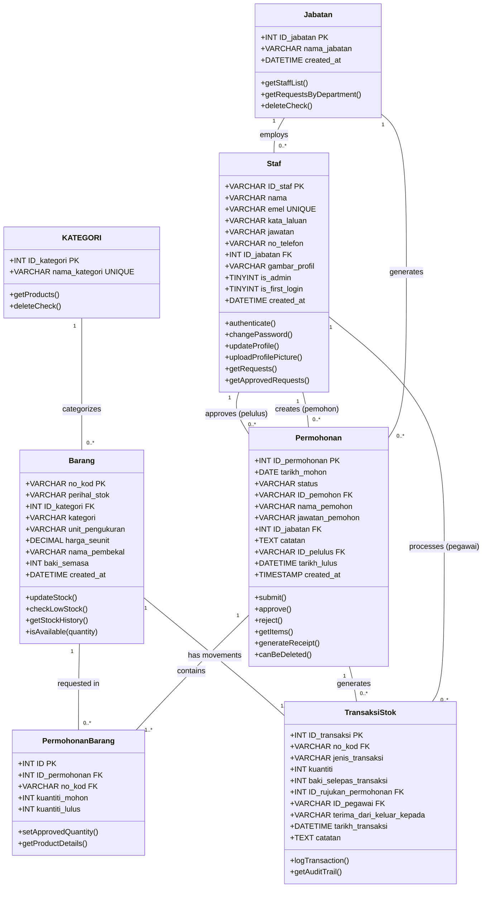

---

## 2. Use Case Diagram

### System Use Cases (Actor-Based UML)

```mermaid
flowchart TB
    %% Actors (Outside System Boundary)
    Staff((Staff<br/>Pemohon))
    Admin((Admin<br/>Pelulus))
    TelegramBot((Telegram Bot<br/>System))

    %% System Boundary
    subgraph SystemBoundary["Sistem Pengurusan Bilik Stor dan Inventori MPK"]
        direction TB

        %% Common Use Cases
        UC1((Login to<br/>System))
        UC2((Change<br/>Password))
        UC3((Update<br/>Profile))
        UC4((Browse<br/>Products))

        %% Staff-Specific Use Cases
        UC5((Submit Stock<br/>Request<br/>KEW.PS-8))
        UC6((View Request<br/>History))
        UC7((Delete Pending<br/>Request))
        UC15((Print Receipt<br/>KEW.PS-8))

        %% Admin-Specific Use Cases
        UC8((Approve/Reject<br/>Request))
        UC9((Manage<br/>Products))
        UC10((Manage Stock<br/>Manual IN/OUT))
        UC11((Manage<br/>Departments))
        UC12((Manage<br/>Users))
        UC13((Generate<br/>Reports))
        UC14((View<br/>Dashboard))
        UC16((Print<br/>KEW.PS-3))
    end

    %% Staff Associations
    Staff ---|participates| UC1
    Staff ---|participates| UC2
    Staff ---|participates| UC3
    Staff ---|participates| UC4
    Staff ---|initiates| UC5
    Staff ---|views| UC6
    Staff ---|manages| UC7
    Staff ---|prints| UC15

    %% Admin Associations
    Admin ---|participates| UC1
    Admin ---|participates| UC2
    Admin ---|participates| UC3
    Admin ---|processes| UC8
    Admin ---|manages| UC9
    Admin ---|manages| UC10
    Admin ---|manages| UC11
    Admin ---|manages| UC12
    Admin ---|generates| UC13
    Admin ---|views| UC14
    Admin ---|prints| UC15
    Admin ---|prints| UC16

    %% System Interactions (External Actor)
    UC5 -.->|notifies| TelegramBot
    UC8 -.->|notifies| TelegramBot

    %% Styling
    style Staff fill:#10b981,stroke:#059669,color:#fff,stroke-width:3px
    style Admin fill:#f59e0b,stroke:#d97706,color:#fff,stroke-width:3px
    style TelegramBot fill:#3b82f6,stroke:#2563eb,color:#fff,stroke-width:3px
    style SystemBoundary fill:#f9fafb,stroke:#6b7280,stroke-width:4px

    %% Use Case Styling
    style UC1 fill:#e0e7ff,stroke:#4f46e5,stroke-width:2px
    style UC2 fill:#e0e7ff,stroke:#4f46e5,stroke-width:2px
    style UC3 fill:#e0e7ff,stroke:#4f46e5,stroke-width:2px
    style UC4 fill:#dbeafe,stroke:#3b82f6,stroke-width:2px
    style UC5 fill:#dcfce7,stroke:#10b981,stroke-width:2px
    style UC6 fill:#dbeafe,stroke:#3b82f6,stroke-width:2px
    style UC7 fill:#dbeafe,stroke:#3b82f6,stroke-width:2px
    style UC8 fill:#fef3c7,stroke:#f59e0b,stroke-width:2px
    style UC9 fill:#fef3c7,stroke:#f59e0b,stroke-width:2px
    style UC10 fill:#fef3c7,stroke:#f59e0b,stroke-width:2px
    style UC11 fill:#fef3c7,stroke:#f59e0b,stroke-width:2px
    style UC12 fill:#fef3c7,stroke:#f59e0b,stroke-width:2px
    style UC13 fill:#fef3c7,stroke:#f59e0b,stroke-width:2px
    style UC14 fill:#fef3c7,stroke:#f59e0b,stroke-width:2px
    style UC15 fill:#e0e7ff,stroke:#4f46e5,stroke-width:2px
    style UC16 fill:#fef3c7,stroke:#f59e0b,stroke-width:2px
```

### Use Case Descriptions

| Use Case | Actor | Description | Precondition |
|----------|-------|-------------|--------------|
| **UC1: Login to System** | Staff, Admin | User authenticates with ID_staf and password | Valid account exists |
| **UC2: Change Password** | Staff, Admin | User updates their password | User is logged in |
| **UC3: Update Profile** | Staff, Admin | User updates profile info and picture | User is logged in |
| **UC4: Browse Products** | Staff | View available products and stock levels | User is logged in |
| **UC5: Submit Stock Request** | Staff | Create KEW.PS-8 request with items | User is logged in, products available |
| **UC6: View Request History** | Staff | View own request status and history | User is logged in |
| **UC7: Delete Pending Request** | Staff | Delete own request if status='Baru' | Request status must be 'Baru' |
| **UC8: Approve/Reject Request** | Admin | Process pending staff requests | Admin is logged in, request is pending |
| **UC9: Manage Products** | Admin | CRUD operations on products | Admin is logged in |
| **UC10: Manage Stock** | Admin | Manual stock adjustments (IN/OUT) | Admin is logged in |
| **UC11: Manage Departments** | Admin | CRUD operations on departments | Admin is logged in |
| **UC12: Manage Users** | Admin | CRUD operations on staff accounts | Admin is logged in |
| **UC13: Generate Reports** | Admin | View inventory/request reports | Admin is logged in |
| **UC14: View Dashboard** | Admin | View system statistics | Admin is logged in |
| **UC15: Print Receipt (KEW.PS-8)** | Staff, Admin | Print request receipt | Request exists |
| **UC16: Print KEW.PS-3** | Admin | Print inventory report | Admin is logged in |

---

## 3. Sequence Diagrams

### 3.1 Submit Stock Request (Staff)

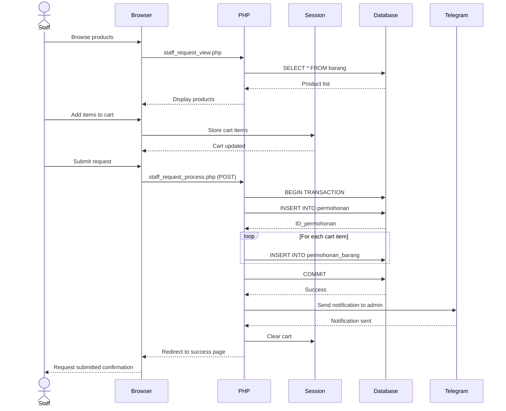

---

### 3.2 Approve Request (Admin)

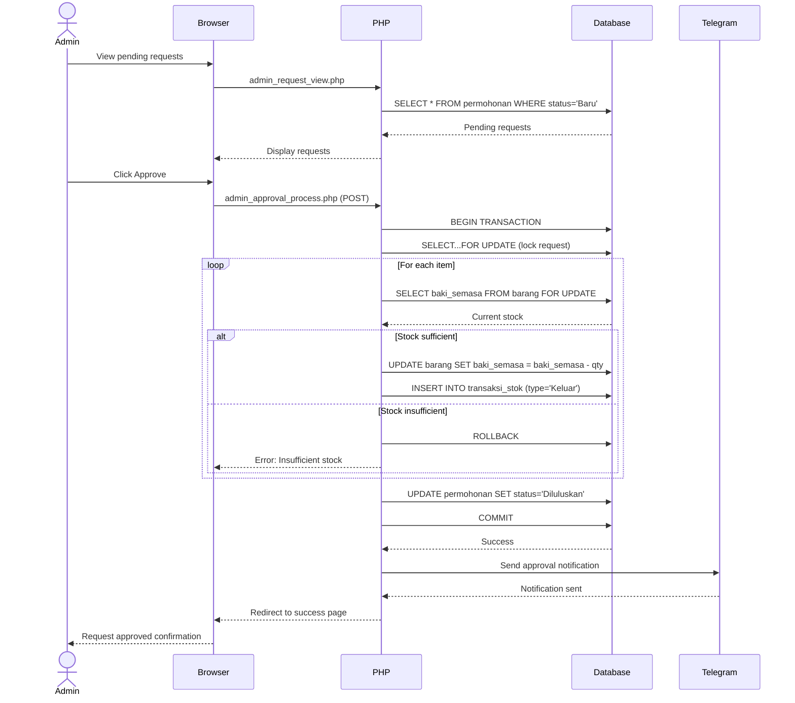

---

### 3.3 User Authentication

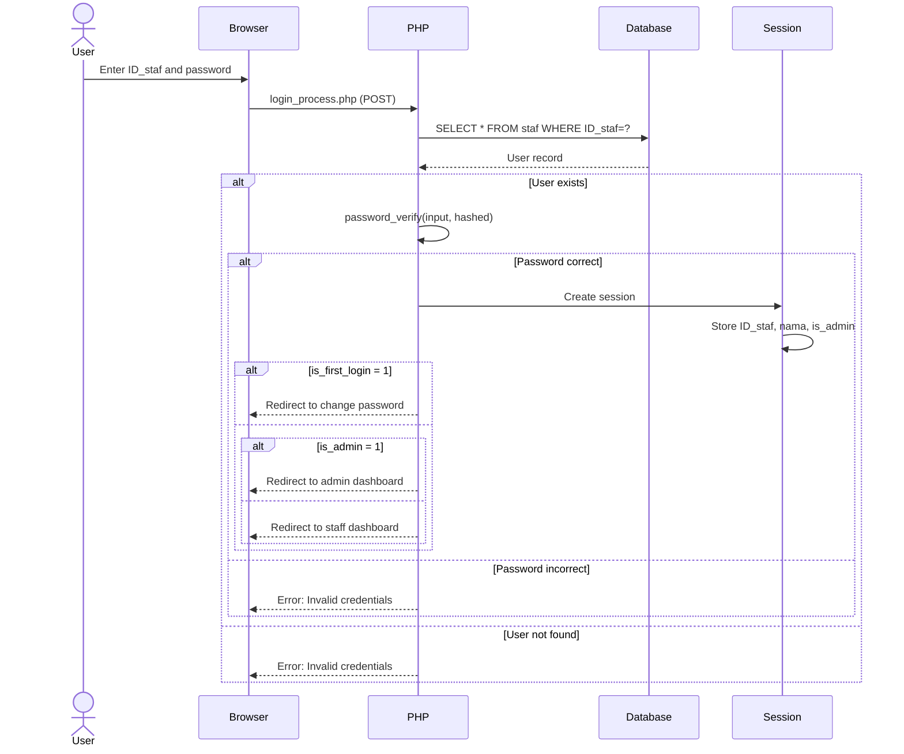

---

### 3.4 Manual Stock Adjustment (Admin)

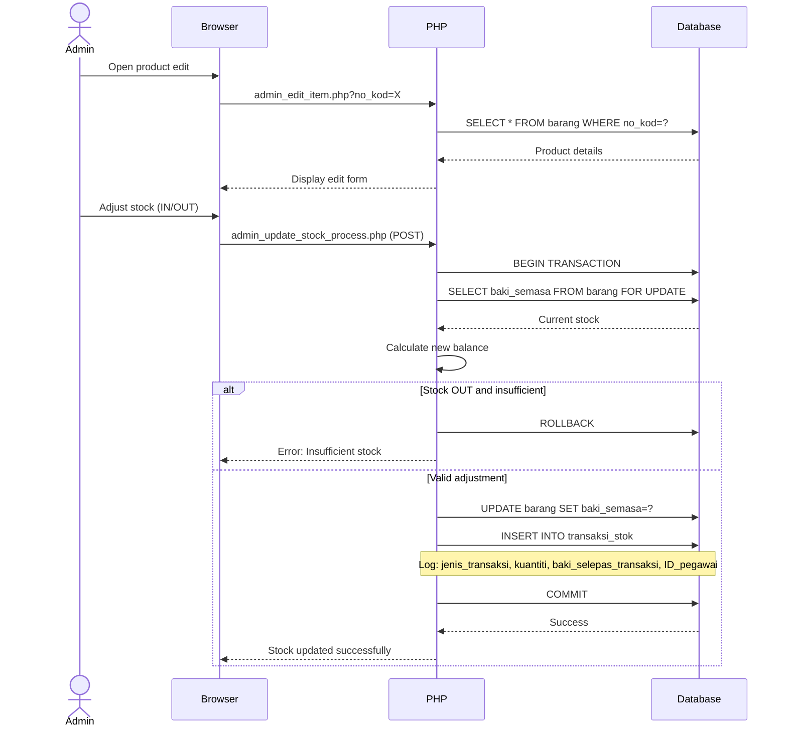

---

## 4. Activity Diagrams

### 4.1 Request Approval Workflow

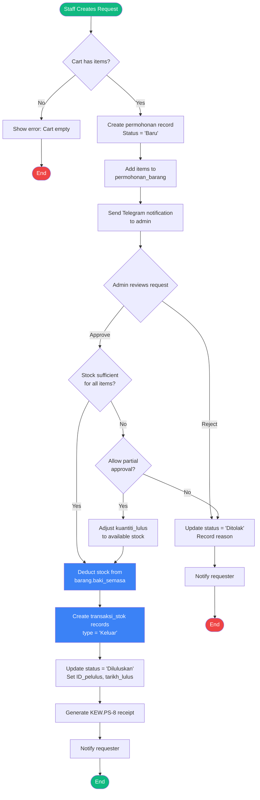

---

### 4.2 User Registration Workflow

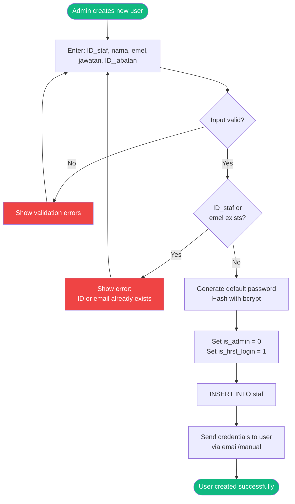

---

## 5. State Diagram

### Request Status State Machine

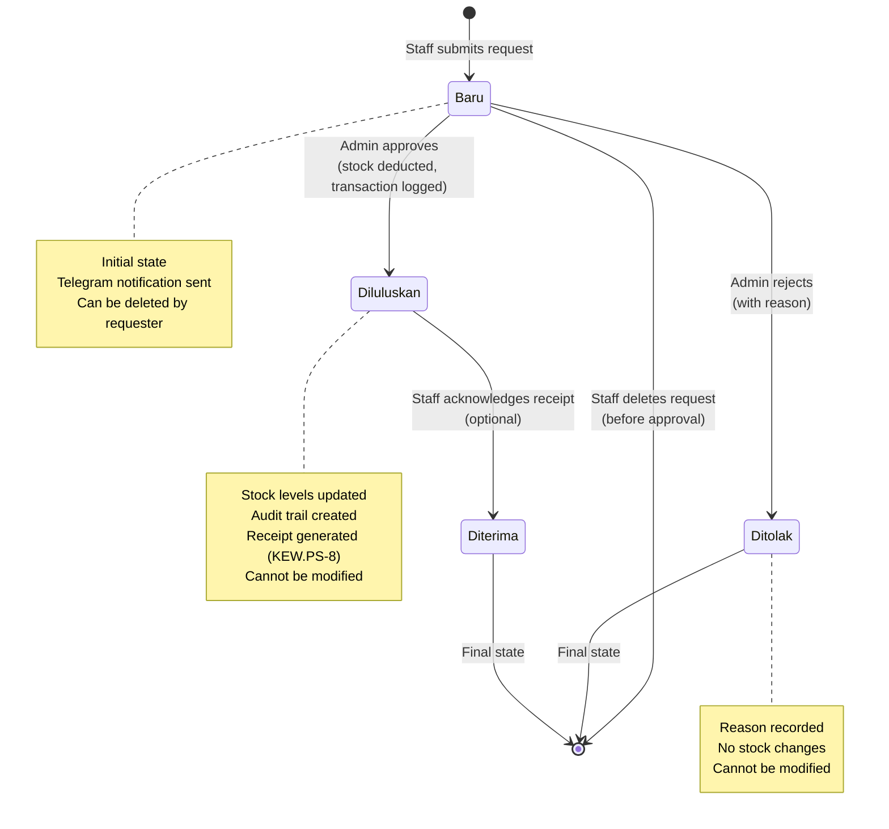

---

## 6. Component Diagram

### System Architecture Components

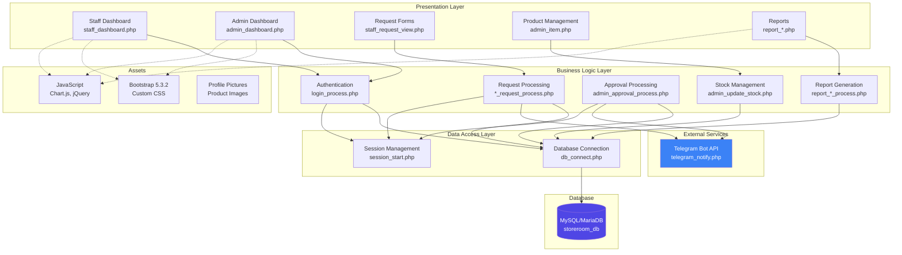

---

## 7. Deployment Diagram

### System Deployment Architecture

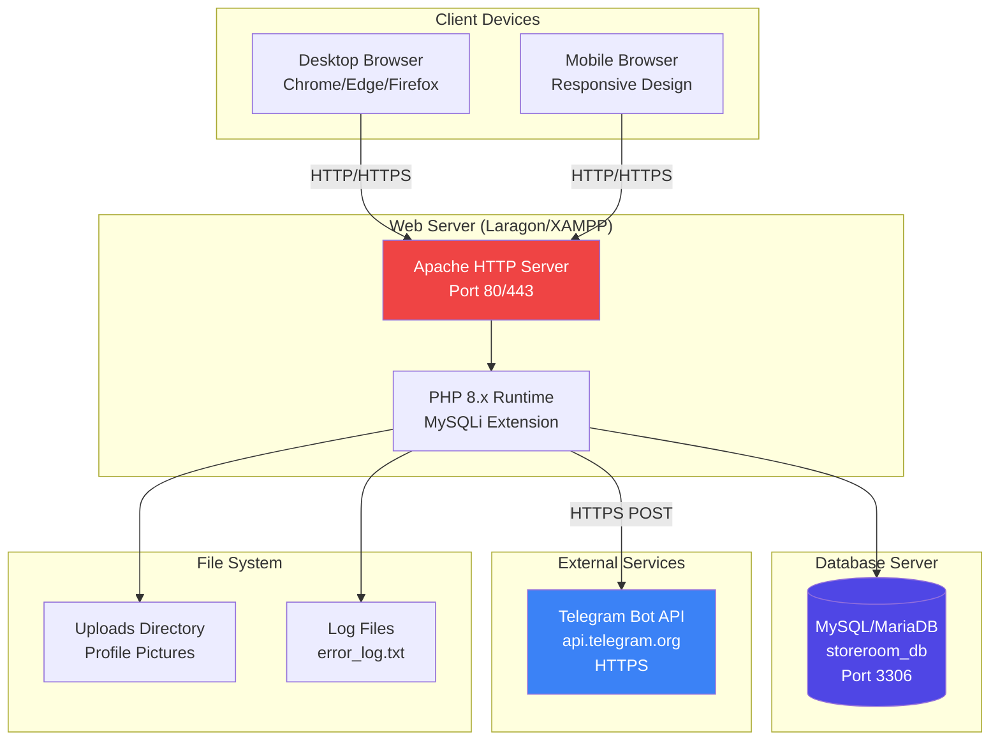

---

## 8. Package Diagram

### Code Organization

```mermaid
graph TB
    subgraph "Root Package"
        subgraph "Authentication Package"
            AUTH1[login.php]
            AUTH2[login_process.php]
            AUTH3[logout.php]
            AUTH4[session_start.php]
        end

        subgraph "Staff Package"
            STAFF1[staff_dashboard.php]
            STAFF2[staff_request_view.php]
            STAFF3[staff_request_process.php]
            STAFF4[staff_profile.php]
        end

        subgraph "Admin Package"
            ADMIN1[admin_dashboard.php]
            ADMIN2[admin_item.php]
            ADMIN3[admin_approval.php]
            ADMIN4[admin_department.php]
            ADMIN5[admin_user.php]
        end

        subgraph "Reports Package"
            REPORT1[report_requests.php]
            REPORT2[report_inventory.php]
            REPORT3[kewps3.php]
            REPORT4[kewps8_print.php]
        end

        subgraph "Utilities Package"
            UTIL1[db_connect.php]
            UTIL2[telegram_notify.php]
            UTIL3[functions.php]
        end

        subgraph "Assets Package"
            ASSET1[/css]
            ASSET2[/js]
            ASSET3[/uploads]
        end
    end

    STAFF1 --> AUTH4
    STAFF2 --> UTIL1
    STAFF3 --> UTIL1
    STAFF3 --> UTIL2

    ADMIN1 --> AUTH4
    ADMIN2 --> UTIL1
    ADMIN3 --> UTIL1
    ADMIN3 --> UTIL2

    REPORT1 --> UTIL1
    REPORT2 --> UTIL1

    AUTH2 --> UTIL1
```

---

## Summary

This UML documentation provides comprehensive visual representations of the Storeroom Management System:

1. **Class Diagram** - Database entities as classes with attributes and methods
2. **Use Case Diagram** - User interactions and system functionality
3. **Sequence Diagrams** - Step-by-step process flows for key operations
4. **Activity Diagrams** - Workflow logic and decision points
5. **State Diagram** - Request status lifecycle
6. **Component Diagram** - System architecture and component relationships
7. **Deployment Diagram** - Physical deployment architecture
8. **Package Diagram** - Code organization structure

### Key Design Patterns Identified:

- **MVC Pattern**: Separation of presentation, business logic, and data layers
- **Transaction Script**: Business logic organized around database transactions
- **Repository Pattern**: Database access abstraction through db_connect.php
- **Session State**: User state management via PHP sessions
- **Observer Pattern**: Telegram notifications triggered by system events

### Architecture Characteristics:

- **Layered Architecture**: Clear separation of concerns
- **Monolithic**: Single deployment unit
- **Database-Centric**: Strong reliance on relational database
- **Synchronous Processing**: No background jobs or queues
- **Stateful**: Session-based user state management

---

**Document Version:** 1.0
**Generated:** 30 December 2025
**Database:** storeroom_db (7 tables, 8 FK constraints)
**System:** Sistem Pengurusan Bilik Stor dan Inventori MPK
**Status:** Production-Ready, Cleaned & Optimized
