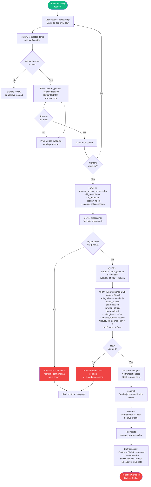

# Request & Approval Workflow Flowchart
**Sistem Pengurusan Bilik Stor dan Inventori - MPK**

**Document Version:** 1.0
**Generated:** 7 January 2026
**Purpose:** Complete end-to-end request and approval workflow visualization

---

## 📋 Table of Contents

1. [Complete Request & Approval Workflow](#1-complete-request--approval-workflow)
2. [Staff Request Submission Flow](#2-staff-request-submission-flow)
3. [Admin Approval Process Flow](#3-admin-approval-process-flow)
4. [Admin Rejection Process Flow](#4-admin-rejection-process-flow)
5. [Stock Update Process Flow](#5-stock-update-process-flow)
6. [Process Summary Table](#6-process-summary-table)

---

## 1. Complete Request & Approval Workflow

### End-to-End Process Overview

```mermaid
flowchart TD
    Start([Staff needs<br/>inventory items]) --> Login{Staff<br/>logged in?}

    Login -->|No| LoginPage[Navigate to login.php]
    LoginPage --> DoLogin[Enter credentials]
    DoLogin --> Auth{Valid<br/>credentials?}
    Auth -->|No| LoginError[Show error message]
    LoginError --> LoginPage
    Auth -->|Yes| StaffDash[Redirect to<br/>staff_dashboard.php]

    Login -->|Yes| StaffDash

    StaffDash --> BrowseProducts[Click Hantar Permohonan<br/>kewps8_form.php]

    BrowseProducts --> LoadProducts[QUERY: SELECT * FROM barang<br/>WHERE baki_semasa > 0]

    LoadProducts --> DisplayProducts[Display available products<br/>with stock levels]

    DisplayProducts --> SelectItems[Staff browses and<br/>adds items to cart]

    SelectItems --> AddToCart[AJAX: Add to session cart<br/>kewps8_cart_ajax.php]

    AddToCart --> CartCheck{Continue<br/>shopping?}

    CartCheck -->|Yes| DisplayProducts
    CartCheck -->|No| ReviewCart[Review cart items<br/>View quantities]

    ReviewCart --> JawatanLoad[Smart Jawatan Autocomplete:<br/>AJAX fetch suggestions<br/>get_jawatan_suggestions.php]

    JawatanLoad --> AutoFill[Auto-fill jawatan from:<br/>1. Profile staf.jawatan<br/>2. Previous requests history]

    AutoFill --> EnterNotes[Optional: Enter catatan<br/>staff remarks/notes]

    EnterNotes --> ValidateCart{Cart has<br/>items?}

    ValidateCart -->|No| ErrorEmpty[Error: Cart kosong]
    ErrorEmpty --> DisplayProducts

    ValidateCart -->|Yes| SubmitRequest[Click Hantar Permohonan<br/>POST to kewps8_form_process.php]

    SubmitRequest --> BeginTrans[BEGIN TRANSACTION]

    BeginTrans --> GetStaffInfo[QUERY: SELECT nama, ID_jabatan<br/>FROM staf WHERE ID_staf = ?]

    GetStaffInfo --> InsertHeader[INSERT INTO permohonan:<br/>- tarikh_mohon = CURDATE<br/>- masa_mohon = NOW<br/>- status = Baru<br/>- ID_pemohon, nama_pemohon<br/>- jawatan_pemohon from session<br/>- catatan, ID_jabatan]

    InsertHeader --> GetRequestID[Get LAST_INSERT_ID<br/>ID_permohonan]

    GetRequestID --> LoopItems[Loop through cart items]

    LoopItems --> InsertItem[INSERT INTO permohonan_barang:<br/>- ID_permohonan<br/>- no_kod<br/>- kuantiti_mohon]

    InsertItem --> MoreItems{More items<br/>in cart?}

    MoreItems -->|Yes| LoopItems
    MoreItems -->|No| CommitTrans[COMMIT TRANSACTION]

    CommitTrans --> ClearCart[Clear session cart,<br/>catatan, jawatan]

    ClearCart --> SendTelegram[Send Telegram notification<br/>telegram_helper.php]

    SendTelegram --> FormatMsg[Format smart message:<br/>🔔 PERMOHONAN BARU<br/>ID, Pemohon, Jabatan<br/>Jawatan IF not empty<br/>Catatan IF not empty]

    FormatMsg --> TelegramAPI[POST to Telegram Bot API<br/>https://api.telegram.org/bot...]

    TelegramAPI --> TelegramSent{Sent<br/>successfully?}

    TelegramSent -->|Yes| SuccessWithNotif[Success message:<br/>Permohonan berjaya<br/>Admin telah dimaklumkan]
    TelegramSent -->|No| SuccessNoNotif[Success message:<br/>Permohonan berjaya<br/>Notifikasi gagal]

    SuccessWithNotif --> ShowReceipt[Display request ID<br/>and confirmation]
    SuccessNoNotif --> ShowReceipt

    ShowReceipt --> StaffWaits[Staff waits for<br/>admin approval]

    StaffWaits --> AdminNotified[Admin receives<br/>Telegram notification]

    AdminNotified --> AdminLogin{Admin<br/>logged in?}

    AdminLogin -->|No| AdminLoginPage[Admin navigates to login]
    AdminLoginPage --> AdminAuth[Enter admin credentials]
    AdminAuth --> AdminValidate{is_admin<br/>= 1?}
    AdminValidate -->|No| AdminDenied[Access Denied]
    AdminDenied --> AdminLoginPage
    AdminValidate -->|Yes| AdminDash[Admin Dashboard]

    AdminLogin -->|Yes| AdminDash

    AdminDash --> CheckPending[View Permohonan Tertunda<br/>stat card or modal]

    CheckPending --> LoadPending[QUERY: SELECT * FROM permohonan<br/>WHERE status = Baru<br/>ORDER BY tarikh_mohon]

    LoadPending --> DisplayPending[Display pending requests<br/>with Baru badges]

    DisplayPending --> SelectRequest[Admin clicks Semak<br/>on a request]

    SelectRequest --> LoadDetails[QUERY: SELECT p.*, pb.*, b.*<br/>FROM permohonan p<br/>JOIN permohonan_barang pb<br/>JOIN barang b<br/>WHERE ID_permohonan = ?]

    LoadDetails --> DisplayReview[Display request_review.php:<br/>- Requester info nama, jawatan, jabatan<br/>- Staff catatan remarks<br/>- Items with current stock<br/>- Form for kuantiti_lulus<br/>- Admin remarks field]

    DisplayReview --> AdminDecision{Admin<br/>decision?}

    AdminDecision -->|Approve| CheckSelfApproval{ID_pemohon<br/>= ID_pelulus?}
    AdminDecision -->|Reject| EnterRejection[Enter catatan_pelulus<br/>rejection reason]

    CheckSelfApproval -->|Yes| BlockSelfApproval[Error: Anda tidak boleh<br/>meluluskan permohonan<br/>anda sendiri]
    BlockSelfApproval --> DisplayReview

    CheckSelfApproval -->|No| SetQuantities[Admin sets kuantiti_lulus<br/>for each item<br/>can be partial or full]

    SetQuantities --> EnterApprovalNotes[Optional: Enter catatan_pelulus<br/>approval notes]

    EnterApprovalNotes --> ClickApprove[Click Lulus button<br/>POST to request_review_process.php]

    ClickApprove --> BeginApproval[BEGIN TRANSACTION]

    BeginApproval --> GetApproverInfo[QUERY: SELECT nama, jawatan<br/>FROM staf<br/>WHERE ID_staf = pelulus]

    GetApproverInfo --> LoopApproval[Loop through items]

    LoopApproval --> LockProduct[SELECT baki_semasa, harga_seunit<br/>FROM barang<br/>WHERE no_kod = ?<br/>FOR UPDATE]

    LockProduct --> CheckStock{baki_semasa >=<br/>kuantiti_lulus?}

    CheckStock -->|No| RollbackInsufficient[ROLLBACK TRANSACTION<br/>Error: Stok tidak mencukupi]
    RollbackInsufficient --> DisplayReview

    CheckStock -->|Yes| DeductStock[UPDATE barang<br/>SET baki_semasa =<br/>baki_semasa - kuantiti_lulus]

    DeductStock --> UpdateApproved[UPDATE permohonan_barang<br/>SET kuantiti_lulus = ?]

    UpdateApproved --> CalcBalance[Calculate:<br/>baki_selepas_transaksi =<br/>baki_semasa - kuantiti_lulus]

    CalcBalance --> LogTransaction[INSERT INTO transaksi_stok:<br/>- no_kod<br/>- jenis_transaksi = Keluar<br/>- kuantiti = kuantiti_lulus<br/>- baki_selepas_transaksi<br/>- ID_rujukan_permohonan<br/>- tarikh_transaksi = NOW]

    LogTransaction --> MoreApprovalItems{More items<br/>to process?}

    MoreApprovalItems -->|Yes| LoopApproval
    MoreApprovalItems -->|No| UpdateRequestStatus[UPDATE permohonan SET:<br/>- status = Diluluskan<br/>- ID_pelulus<br/>- nama_pelulus denormalized<br/>- jawatan_pelulus denormalized<br/>- tarikh_lulus = NOW<br/>- catatan_admin]

    UpdateRequestStatus --> CommitApproval[COMMIT TRANSACTION]

    CommitApproval --> ApprovalSuccess[Success message:<br/>Permohonan telah diluluskan<br/>Stok telah dikemaskini]

    ApprovalSuccess --> StaffViewsApproval[Staff can view:<br/>- Status = Diluluskan<br/>- Admin remarks catatan_admin<br/>- Approved quantities<br/>- Print KEW.PS-8]

    StaffViewsApproval --> End1([End: Request Approved])

    EnterRejection --> EnterRejectionNotes[Enter catatan_pelulus<br/>rejection reason required]

    EnterRejectionNotes --> CheckSelfReject{ID_pemohon<br/>= ID_pelulus?}

    CheckSelfReject -->|Yes| BlockSelfReject[Error: Anda tidak boleh<br/>menolak permohonan<br/>anda sendiri]
    BlockSelfReject --> DisplayReview

    CheckSelfReject -->|No| ClickReject[Click Tolak button<br/>POST to request_review_process.php]

    ClickReject --> GetRejecterInfo[QUERY: SELECT nama, jawatan<br/>FROM staf<br/>WHERE ID_staf = pelulus]

    GetRejecterInfo --> UpdateRejected[UPDATE permohonan SET:<br/>- status = Ditolak<br/>- ID_pelulus<br/>- nama_pelulus denormalized<br/>- jawatan_pelulus denormalized<br/>- tarikh_lulus = NOW<br/>- catatan_admin rejection reason]

    UpdateRejected --> RejectionSuccess[Success message:<br/>Permohonan telah ditolak]

    RejectionSuccess --> StaffViewsRejection[Staff can view:<br/>- Status = Ditolak<br/>- Admin remarks catatan_admin<br/>- Rejection reason]

    StaffViewsRejection --> End2([End: Request Rejected])

    style Start fill:#10b981,color:#fff
    style End1 fill:#10b981,color:#fff
    style End2 fill:#ef4444,color:#fff
    style BeginTrans fill:#8b5cf6,color:#fff
    style CommitTrans fill:#8b5cf6,color:#fff
    style BeginApproval fill:#8b5cf6,color:#fff
    style CommitApproval fill:#8b5cf6,color:#fff
    style BlockSelfApproval fill:#ef4444,color:#fff
    style BlockSelfReject fill:#ef4444,color:#fff
    style RollbackInsufficient fill:#ef4444,color:#fff
```



---

## 2. Staff Request Submission Flow

### Detailed Staff Workflow

```mermaid
flowchart TD
    Start([Staff Dashboard]) --> ClickSubmit[Click Hantar Permohonan]

    ClickSubmit --> LoadForm[Load kewps8_form.php]

    LoadForm --> QueryProducts[QUERY:<br/>SELECT b.*, k.nama_kategori<br/>FROM barang b<br/>LEFT JOIN KATEGORI k<br/>ON b.ID_kategori = k.ID_kategori<br/>WHERE b.baki_semasa > 0<br/>ORDER BY b.perihal_stok]

    QueryProducts --> DisplayCatalog[Display product catalog:<br/>- Categories in tabs<br/>- Product cards with stock levels<br/>- Add to cart buttons]

    DisplayCatalog --> StaffBrowse{Staff<br/>browsing}

    StaffBrowse -->|Add item| ClickAdd[Click Tambah ke Permohonan]

    ClickAdd --> AjaxAdd[AJAX POST:<br/>kewps8_cart_ajax.php?action=add<br/>- no_kod<br/>- perihal_stok<br/>- kuantiti default 1]

    AjaxAdd --> AddToSession[Add to $_SESSION cart:<br/>cart = no_kod<br/>- perihal_stok<br/>- kuantiti<br/>- unit_pengukuran]

    AddToSession --> UpdateCart[Return JSON:<br/>success: true<br/>cart_count: X<br/>item details]

    UpdateCart --> RefreshCartUI[Update cart badge:<br/>Show X items<br/>Update cart modal list]

    RefreshCartUI --> StaffBrowse

    StaffBrowse -->|View cart| OpenCart[Click cart icon<br/>or Lihat Permohonan]

    OpenCart --> DisplayCartModal[Show cart modal:<br/>- List of items<br/>- Quantities editable<br/>- Remove buttons<br/>- Catatan field<br/>- Jawatan field]

    DisplayCartModal --> JawatanAjax[AJAX:<br/>get_jawatan_suggestions.php<br/>Fetch profile & history jawatan]

    JawatanAjax --> QueryProfile[QUERY:<br/>SELECT jawatan FROM staf<br/>WHERE ID_staf = session ID]

    QueryProfile --> QueryHistory[QUERY:<br/>SELECT DISTINCT jawatan_pemohon<br/>FROM permohonan<br/>WHERE ID_pemohon = session ID<br/>LIMIT 5]

    QueryHistory --> MergeSuggestions[Merge and deduplicate:<br/>- Profile jawatan<br/>- Recent history jawatan<br/>Label sources]

    MergeSuggestions --> AutoFillJawatan[Auto-fill jawatan field<br/>Show dropdown suggestions<br/>datalist HTML5]

    AutoFillJawatan --> StaffReview{Staff<br/>reviews cart}

    StaffReview -->|Modify| EditQuantity[Change quantities<br/>or remove items<br/>AJAX updates session]
    StaffReview -->|Add notes| EnterCatatan[Enter catatan field<br/>staff remarks optional]
    StaffReview -->|Edit jawatan| ModifyJawatan[Edit or select jawatan<br/>from suggestions]

    EditQuantity --> StaffReview
    EnterCatatan --> StaffReview
    ModifyJawatan --> StaffReview

    StaffReview -->|Submit| ClickSubmitBtn[Click Hantar button<br/>in modal]

    ClickSubmitBtn --> ValidateBeforeSubmit{Cart<br/>not empty?}

    ValidateBeforeSubmit -->|No| ShowEmptyError[SweetAlert:<br/>Sila tambah item]
    ShowEmptyError --> DisplayCartModal

    ValidateBeforeSubmit -->|Yes| PostToProcess[POST to:<br/>kewps8_form_process.php<br/>- cart items<br/>- catatan<br/>- jawatan]

    PostToProcess --> ProcessStart[Server-side processing<br/>auth_check.php validates session]

    ProcessStart --> GetCartFromSession[Get $_SESSION cart array<br/>catatan, jawatan]

    GetCartFromSession --> ValidateServerSide{Cart<br/>has items?}

    ValidateServerSide -->|No| ErrorServer[Redirect with error:<br/>Cart kosong]
    ValidateServerSide -->|Yes| BeginTransaction[BEGIN TRANSACTION]

    BeginTransaction --> FetchStaffInfo[QUERY:<br/>SELECT nama, ID_jabatan<br/>FROM staf<br/>WHERE ID_staf = session ID]

    FetchStaffInfo --> PrepareInsert[Prepare request data:<br/>- tarikh_mohon = CURDATE<br/>- masa_mohon = NOW<br/>- status = Baru<br/>- nama_pemohon from query<br/>- jawatan_pemohon from session<br/>- catatan from session]

    PrepareInsert --> InsertPermohonan[INSERT INTO permohonan<br/>all fields prepared]

    InsertPermohonan --> GetNewID[Get LAST_INSERT_ID<br/>new ID_permohonan]

    GetNewID --> LoopCartItems[foreach cart item]

    LoopCartItems --> InsertItemDetail[INSERT INTO permohonan_barang:<br/>- ID_permohonan<br/>- no_kod<br/>- kuantiti_mohon]

    InsertItemDetail --> NextItem{More<br/>items?}

    NextItem -->|Yes| LoopCartItems
    NextItem -->|No| CommitSuccess[COMMIT TRANSACTION]

    CommitSuccess --> ClearSessionData[Unset $_SESSION:<br/>- cart<br/>- catatan<br/>- jawatan]

    ClearSessionData --> NotifyTelegram[Call telegram_helper.php:<br/>sendNewRequestNotification]

    NotifyTelegram --> BuildMessage[Build smart message:<br/>Include ID, nama, jabatan<br/>Include jawatan IF set<br/>Include catatan IF set]

    BuildMessage --> SendToAPI[cURL POST:<br/>Telegram Bot API<br/>sendMessage endpoint]

    SendToAPI --> TelegramResult{API<br/>success?}

    TelegramResult -->|Yes| LogTelegramSuccess[Optional: Log success]
    TelegramResult -->|No| LogTelegramFail[Log failure<br/>but don't block request]

    LogTelegramSuccess --> ShowSuccess[Redirect to success page:<br/>SweetAlert success<br/>Show ID_permohonan<br/>Link to view receipt]
    LogTelegramFail --> ShowSuccess

    ShowSuccess --> End([Request Submitted<br/>Status: Baru])

    style Start fill:#10b981,color:#fff
    style End fill:#10b981,color:#fff
    style BeginTransaction fill:#8b5cf6,color:#fff
    style CommitSuccess fill:#8b5cf6,color:#fff
    style ShowEmptyError fill:#ef4444,color:#fff
    style ErrorServer fill:#ef4444,color:#fff
```



---

## 3. Admin Approval Process Flow

### Detailed Approval Workflow

```mermaid
flowchart TD
    Start([Admin Dashboard]) --> ViewPending[Click Permohonan Tertunda<br/>or Urus Permohonan]

    ViewPending --> LoadRequests[QUERY:<br/>SELECT p.*, s.nama as nama_pemohon,<br/>j.nama_jabatan,<br/>COUNT pb.ID as item_count<br/>FROM permohonan p<br/>LEFT JOIN staf s<br/>LEFT JOIN jabatan j<br/>LEFT JOIN permohonan_barang pb<br/>WHERE p.status = Baru<br/>GROUP BY p.ID_permohonan<br/>ORDER BY p.tarikh_mohon ASC]

    LoadRequests --> DisplayTable[Display manage_requests.php:<br/>- Request list table<br/>- Baru status badges<br/>- Semak action buttons<br/>- Quick info modals]

    DisplayTable --> SelectReq[Admin clicks Semak<br/>on specific request]

    SelectReq --> LoadReviewPage[Navigate to:<br/>request_review.php?id=X]

    LoadReviewPage --> QueryDetails[QUERY:<br/>SELECT p.*,<br/>COALESCE NULLIF p.jawatan_pemohon, '' ,<br/>pemohon.jawatan AS jawatan_pemohon,<br/>pemohon.nama, pemohon.emel,<br/>jabatan.nama_jabatan<br/>FROM permohonan p<br/>JOIN staf pemohon<br/>LEFT JOIN jabatan<br/>WHERE ID_permohonan = ?]

    QueryDetails --> QueryItems[QUERY:<br/>SELECT pb.*, b.perihal_stok,<br/>b.baki_semasa, b.unit_pengukuran<br/>FROM permohonan_barang pb<br/>JOIN barang b<br/>ON pb.no_kod = b.no_kod<br/>WHERE pb.ID_permohonan = ?]

    QueryItems --> DisplayReviewForm[Display review form:<br/>- Requester details nama, ID<br/>- Jawatan smart COALESCE display<br/>- Jabatan, tarikh_mohon<br/>- Staff catatan IF exists<br/>- Items table with:<br/>  • Product name<br/>  • Quantity requested<br/>  • Current stock<br/>  • Input kuantiti_lulus<br/>- Admin remarks textarea<br/>- Lulus/Tolak buttons]

    DisplayReviewForm --> AdminReviews{Admin<br/>reviews}

    AdminReviews -->|Check stock| ViewStock[View baki_semasa<br/>for each item<br/>Stock indicators:<br/>Green if sufficient<br/>Red if insufficient]

    ViewStock --> AdminReviews

    AdminReviews -->|Enter quantities| SetKuantitiLulus[For each item:<br/>Set kuantiti_lulus<br/>Default = kuantiti_mohon<br/>Can be partial or 0]

    SetKuantitiLulus --> AdminReviews

    AdminReviews -->|Add notes| TypeRemarks[Enter catatan_pelulus<br/>approval notes<br/>Optional but recommended]

    TypeRemarks --> AdminReviews

    AdminReviews -->|Approve| ClickLulus[Click Lulus button]

    ClickLulus --> ConfirmApproval{Confirm<br/>approval?}

    ConfirmApproval -->|No| AdminReviews
    ConfirmApproval -->|Yes| PostApproval[POST to:<br/>request_review_process.php<br/>- id_permohonan<br/>- id_pemohon<br/>- action = approve<br/>- items array<br/>- catatan_pelulus]

    PostApproval --> ServerApproval[Server processing:<br/>admin_auth_check.php]

    ServerApproval --> ValidateAdmin{is_admin<br/>= 1?}

    ValidateAdmin -->|No| DenyAccess[Error: Access denied]
    DenyAccess --> EndError([Unauthorized])

    ValidateAdmin -->|Yes| CheckSelfApproval{id_pemohon<br/>= id_pelulus?}

    CheckSelfApproval -->|Yes| BlockSelf[Error: Anda tidak boleh<br/>meluluskan permohonan<br/>anda sendiri<br/>Kelulusan mesti dibuat<br/>oleh admin lain]
    BlockSelf --> RedirectBack[Redirect to<br/>request_review.php]

    CheckSelfApproval -->|No| GetApproverData[QUERY:<br/>SELECT nama, jawatan<br/>FROM staf<br/>WHERE ID_staf = pelulus]

    GetApproverData --> StoreApprover[Store variables:<br/>nama_pelulus<br/>jawatan_pelulus<br/>For denormalization]

    StoreApprover --> StartTransaction[BEGIN TRANSACTION]

    StartTransaction --> InitItemsLoop[foreach items array]

    InitItemsLoop --> CheckKuantiti{kuantiti_lulus<br/>> 0?}

    CheckKuantiti -->|No 0 quantity| SkipItem[Skip this item<br/>Not approved]
    SkipItem --> NextItemCheck{More<br/>items?}

    CheckKuantiti -->|Yes| LockRow[SELECT baki_semasa,<br/>harga_seunit<br/>FROM barang<br/>WHERE no_kod = ?<br/>FOR UPDATE<br/>Row-level lock]

    LockRow --> GetCurrentStock[Fetch current:<br/>baki_semasa value]

    GetCurrentStock --> ValidateStock{baki_semasa >=<br/>kuantiti_lulus?}

    ValidateStock -->|No| InsufficientStock[ROLLBACK TRANSACTION<br/>Error: Stok tidak mencukupi<br/>untuk product name<br/>Stok semasa: X<br/>Diminta: Y]

    InsufficientStock --> ShowError[Display error<br/>SweetAlert or session message]
    ShowError --> RedirectBack

    ValidateStock -->|Yes| DeductFromStock[UPDATE barang<br/>SET baki_semasa =<br/>baki_semasa - kuantiti_lulus<br/>WHERE no_kod = ?]

    DeductFromStock --> CalculateNewBalance[Calculate:<br/>new_baki =<br/>old_baki - kuantiti_lulus]

    CalculateNewBalance --> UpdateItemApproved[UPDATE permohonan_barang<br/>SET kuantiti_lulus = ?<br/>WHERE ID_permohonan = ?<br/>AND no_kod = ?]

    UpdateItemApproved --> InsertStockLog[INSERT INTO transaksi_stok:<br/>- no_kod<br/>- jenis_transaksi = Keluar<br/>- kuantiti = kuantiti_lulus<br/>- baki_selepas_transaksi = new_baki<br/>- ID_rujukan_permohonan<br/>- tarikh_transaksi = NOW<br/>- ID_pegawai = NULL or admin ID]

    InsertStockLog --> MarkProcessed[Mark item processed<br/>at_least_one_approved = true]

    MarkProcessed --> NextItemCheck

    NextItemCheck -->|Yes| InitItemsLoop
    NextItemCheck -->|No| DetermineFinalStatus{at_least_one<br/>_approved?}

    DetermineFinalStatus -->|Yes| SetDiluluskan[final_status = Diluluskan]
    DetermineFinalStatus -->|No| SetDitolak[final_status = Ditolak<br/>All items quantity 0]

    SetDiluluskan --> UpdateHeader[UPDATE permohonan SET:<br/>- status = final_status<br/>- ID_pelulus = admin ID<br/>- nama_pelulus denormalized<br/>- jawatan_pelulus denormalized<br/>- tarikh_lulus = NOW<br/>- catatan_admin = remarks<br/>WHERE ID_permohonan = ?]

    SetDitolak --> UpdateHeader

    UpdateHeader --> CommitTransaction[COMMIT TRANSACTION]

    CommitTransaction --> SendNotification[Optional:<br/>Send approval notification<br/>to staff email/Telegram]

    SendNotification --> ShowSuccessMsg[Success message:<br/>Permohonan ID telah<br/>berjaya diluluskan<br/>Stok telah dikemaskini]

    ShowSuccessMsg --> RedirectManage[Redirect to:<br/>manage_requests.php]

    RedirectManage --> End([Approval Complete<br/>Status: Diluluskan])

    style Start fill:#10b981,color:#fff
    style End fill:#10b981,color:#fff
    style EndError fill:#ef4444,color:#fff
    style StartTransaction fill:#8b5cf6,color:#fff
    style CommitTransaction fill:#8b5cf6,color:#fff
    style InsufficientStock fill:#ef4444,color:#fff
    style BlockSelf fill:#ef4444,color:#fff
```



---

## 4. Admin Rejection Process Flow

### Rejection Workflow



---

## 5. Stock Update Process Flow

### Stock Deduction During Approval

```mermaid
flowchart TD
    Start([Approval transaction<br/>begins]) --> LoopItems[For each approved item]

    LoopItems --> LockProduct[SELECT * FROM barang<br/>WHERE no_kod = ?<br/>FOR UPDATE<br/>Acquire row lock]

    LockProduct --> ReadCurrentStock[Read current values:<br/>- baki_semasa<br/>- perihal_stok<br/>- harga_seunit]

    ReadCurrentStock --> ValidateQuantity{baki_semasa >=<br/>kuantiti_lulus?}

    ValidateQuantity -->|No| Insufficient[Throw Exception:<br/>Stok tidak mencukupi<br/>untuk product name]

    Insufficient --> RollbackAll[ROLLBACK entire<br/>TRANSACTION<br/>No partial updates]

    RollbackAll --> ErrorMessage[Return error to admin:<br/>Display which product<br/>insufficient<br/>Current stock shown]

    ErrorMessage --> EndFail([Approval Failed<br/>Try Again])

    ValidateQuantity -->|Yes| CalculateNew[Calculate new balance:<br/>new_baki =<br/>baki_semasa - kuantiti_lulus]

    CalculateNew --> UpdateStock[UPDATE barang<br/>SET baki_semasa = new_baki<br/>WHERE no_kod = ?]

    UpdateStock --> VerifyUpdate{UPDATE<br/>successful?}

    VerifyUpdate -->|No| UpdateFailed[Database error<br/>ROLLBACK TRANSACTION]
    UpdateFailed --> EndFail

    VerifyUpdate -->|Yes| UpdateRequestItem[UPDATE permohonan_barang<br/>SET kuantiti_lulus = ?<br/>WHERE ID_permohonan = ?<br/>AND no_kod = ?]

    UpdateRequestItem --> CreateLog[INSERT INTO transaksi_stok:<br/>- no_kod product code<br/>- jenis_transaksi = Keluar<br/>- kuantiti = kuantiti_lulus<br/>- baki_selepas_transaksi<br/>- ID_rujukan_permohonan<br/>- tarikh_transaksi = NOW<br/>- catatan = NULL request ref<br/>- ID_pegawai = NULL or admin ID]

    CreateLog --> VerifyLog{Log<br/>created?}

    VerifyLog -->|No| LogFailed[Audit trail error<br/>ROLLBACK TRANSACTION]
    LogFailed --> EndFail

    VerifyLog -->|Yes| CheckMoreItems{More items<br/>to process?}

    CheckMoreItems -->|Yes| LoopItems
    CheckMoreItems -->|No| AllItemsProcessed[All items processed<br/>successfully]

    AllItemsProcessed --> UpdatePermohonan[UPDATE permohonan:<br/>- status = Diluluskan<br/>- ID_pelulus<br/>- nama_pelulus, jawatan_pelulus<br/>- tarikh_lulus = NOW<br/>- catatan_admin]

    UpdatePermohonan --> CommitTransaction[COMMIT TRANSACTION<br/>All changes permanent]

    CommitTransaction --> ReleaseLocks[Release all row locks<br/>Database available]

    ReleaseLocks --> VerifyFinalState[Verify final state:<br/>- Stock reduced correctly<br/>- Logs created<br/>- Status updated]

    VerifyFinalState --> CheckLowStock{Any product<br/>baki_semasa <= 10?}

    CheckLowStock -->|Yes| TriggerAlert[Trigger low stock alert:<br/>- Admin dashboard indicator<br/>- Optional Telegram warning]
    CheckLowStock -->|No| Success

    TriggerAlert --> Success[Success:<br/>Stock updated atomically<br/>Audit trail complete]

    Success --> End([Stock Updated<br/>Transaction Logged])

    style Start fill:#10b981,color:#fff
    style End fill:#10b981,color:#fff
    style EndFail fill:#ef4444,color:#fff
    style RollbackAll fill:#ef4444,color:#fff
    style CommitTransaction fill:#8b5cf6,color:#fff
```



---

## 6. Process Summary Table

### Key Processes Overview

| Process | Entry Point | Database Tables Affected | Transaction Required | Result |
|---------|-------------|-------------------------|---------------------|---------|
| **Request Submission** | kewps8_form_process.php | `permohonan`, `permohonan_barang` | ✅ Yes | Status: Baru |
| **Approval** | request_review_process.php (action=approve) | `permohonan`, `permohonan_barang`, `barang`, `transaksi_stok` | ✅ Yes | Status: Diluluskan, Stock deducted |
| **Rejection** | request_review_process.php (action=reject) | `permohonan` only | ❌ No | Status: Ditolak, No stock change |
| **Smart Jawatan** | get_jawatan_suggestions.php (AJAX) | `staf`, `permohonan` (read) | ❌ No | JSON suggestions |
| **Cart Management** | kewps8_cart_ajax.php | Session only (no DB) | ❌ No | Session cart updated |
| **Telegram Notify** | telegram_helper.php | None (external API) | ❌ No | Notification sent |

---

### Status Lifecycle

```
[Baru] ──→ [Diluluskan] ──→ [Optional: Diterima]
  │
  └──────→ [Ditolak]
```

**Status Definitions:**
- **Baru:** Request submitted, pending admin review
- **Diluluskan:** Admin approved, stock deducted, transaction logged
- **Ditolak:** Admin rejected, no stock changes
- **Diterima:** (Optional) Staff acknowledged receipt of items

---

### Critical Business Rules

| Rule | Enforcement | Impact |
|------|-------------|--------|
| **Self-Approval Prevention** | Application logic | ❌ CRITICAL - Admin cannot approve own request |
| **Stock Availability** | Row-level locking (FOR UPDATE) | ❌ CRITICAL - Prevents negative stock |
| **Atomic Transactions** | BEGIN...COMMIT/ROLLBACK | ❌ CRITICAL - All-or-nothing updates |
| **Audit Trail** | transaksi_stok mandatory | ✅ HIGH - Complete transaction log |
| **Denormalized Data** | nama_pelulus, jawatan_pelulus stored | ✅ MEDIUM - Historical accuracy |
| **Bidirectional Remarks** | catatan + catatan_admin | ✅ MEDIUM - Transparent communication |
| **Smart Jawatan** | COALESCE logic + autocomplete | ✅ LOW - User convenience |

---

### Files Involved

**Staff Side:**
- `kewps8_form.php` - Request form UI
- `kewps8_cart_ajax.php` - Cart management AJAX
- `get_jawatan_suggestions.php` - Jawatan autocomplete AJAX
- `kewps8_form_process.php` - Request submission processing
- `request_list.php` - View request history

**Admin Side:**
- `manage_requests.php` - Pending requests list
- `request_review.php` - Review request details
- `request_review_process.php` - Approval/rejection processing
- `admin_dashboard.php` - Dashboard with pending count

**Shared:**
- `telegram_helper.php` - Telegram notification functions
- `db.php` - Database connection
- `auth_check.php` / `admin_auth_check.php` - Authentication

---

**Document End**
**Generated:** 7 January 2026
**System:** Sistem Pengurusan Bilik Stor dan Inventori MPK
**Status:** Production-Ready
