# Data Flow Diagram (DFD)
## Sistem Pengurusan Bilik Stor dan Inventori MPK

---

## DFD Level 0 - Context Diagram

Shows the system as a single process with external entities.

```mermaid
graph TD
    Staff["👤 Staff<br/>(Pemohon)"]
    Admin["👨‍💼 Admin<br/>(Pelulus)"]
    TelegramBot["📱 Telegram Bot"]

    System["🏢 Sistem Pengurusan<br/>Bilik Stor & Inventori"]

    Staff -->|"Stock Request<br/>(Permohonan Stok)"| System
    Staff -->|"Login Credentials"| System
    System -->|"Request Status<br/>Receipt (KEW.PS-8)"| Staff

    Admin -->|"Approval/Rejection<br/>(Kelulusan/Penolakan)"| System
    Admin -->|"Stock Updates<br/>(Kemaskini Stok)"| System
    Admin -->|"Product Management<br/>(Urus Produk)"| System
    System -->|"Reports<br/>(Laporan)"| Admin
    System -->|"Low Stock Alerts<br/>(Amaran Stok Rendah)"| Admin

    System -->|"New Request Notification<br/>(Pemberitahuan Permohonan)"| TelegramBot
    System -->|"Monthly Reminder<br/>(Peringatan Bulanan)"| TelegramBot
    TelegramBot -->|"Notifications"| Admin

    style System fill:#4f46e5,stroke:#333,stroke-width:4px,color:#fff
    style Staff fill:#10b981,stroke:#333,stroke-width:2px,color:#fff
    style Admin fill:#f59e0b,stroke:#333,stroke-width:2px,color:#fff
    style TelegramBot fill:#3b82f6,stroke:#333,stroke-width:2px,color:#fff
```

### External Entities:

1. **Staff (Pemohon)** - Regular users who request stock items
2. **Admin (Pelulus)** - Administrators who approve requests and manage system
3. **Telegram Bot** - External notification system

### Data Flows:

**FROM Staff:**
- Login credentials
- Stock requests (KEW.PS-8 form)
- Profile updates

**TO Staff:**
- Request status
- Receipt/proof of request
- Request history

**FROM Admin:**
- Approval/rejection decisions
- Stock level updates
- Product management
- Department management
- User management

**TO Admin:**
- Reports (inventory, requests, suppliers)
- Low stock alerts
- Pending request notifications
- Dashboard statistics

**TO Telegram Bot:**
- New request notifications
- Monthly restock reminders

**FROM Telegram Bot:**
- Notification delivery confirmations

---

## DFD Level 1 - Main Processes

Decomposes the system into major functional processes.

```mermaid
graph TB
    subgraph External["External Entities"]
        Staff["👤 Staff"]
        Admin["👨‍💼 Admin"]
        TelegramBot["📱 Telegram Bot"]
    end

    subgraph System["System Processes"]
        P1["1.0<br/>User<br/>Authentication"]
        P2["2.0<br/>Request<br/>Management"]
        P3["3.0<br/>Approval<br/>Processing"]
        P4["4.0<br/>Inventory<br/>Management"]
        P5["5.0<br/>Reporting<br/>System"]
        P6["6.0<br/>Notification<br/>Service"]
        P7["7.0<br/>User<br/>Management"]
    end

    subgraph DataStores["Data Stores"]
        D1[("D1: staf")]
        D2[("D2: permohonan")]
        D3[("D3: barang")]
        D4[("D4: jabatan")]
        D5[("D5: permohonan_barang")]
        D6[("D6: transaksi_stok")]
        D7[("D7: KATEGORI")]
    end

    %% Authentication Flows
    Staff -->|Login Credentials| P1
    Admin -->|Login Credentials| P1
    P1 -->|User Data| D1
    P1 -->|Session Token| Staff
    P1 -->|Admin Session| Admin

    %% Request Management Flows
    Staff -->|New Request| P2
    P2 -->|Store Request| D2
    P2 -->|Store Items| D5
    P2 -->|Request Confirmation| Staff
    P2 -->|Trigger Notification| P6
    D3 -->|Product Data| P2
    D1 -->|Staff Info| P2
    D4 -->|Department Info| P2

    %% Approval Processing Flows
    Admin -->|Approval Decision| P3
    D2 -->|Pending Requests| P3
    D5 -->|Request Items| P3
    P3 -->|Update Status| D2
    P3 -->|Update Stock| D3
    P3 -->|Trigger Update Notification| P6
    P3 -->|Approval Result| Admin

    %% Inventory Management Flows
    Admin -->|Product CRUD| P4
    Admin -->|Manual Stock Update| P4
    P4 -->|Product Data| D3
    D3 -->|Current Stock| P4
    P4 -->|Low Stock Alert| P6
    P4 -->|Updated Inventory| Admin

    %% Reporting Flows
    Admin -->|Report Request| P5
    D2 -->|Request Data| P5
    D3 -->|Inventory Data| P5
    D1 -->|User Data| P5
    D4 -->|Department Data| P5
    P5 -->|Generated Reports| Admin

    %% Notification Flows
    P6 -->|Send Notification| TelegramBot
    TelegramBot -->|Delivery Status| P6
    P6 -->|Dashboard Alert| Admin

    %% User Management Flows
    Admin -->|Manage Users/Depts| P7
    P7 -->|User CRUD| D1
    P7 -->|Department CRUD| D4
    D1 -->|User List| P7
    D4 -->|Department List| P7
    P7 -->|Updated Data| Admin

    style P1 fill:#8b5cf6,stroke:#333,stroke-width:2px,color:#fff
    style P2 fill:#ec4899,stroke:#333,stroke-width:2px,color:#fff
    style P3 fill:#f59e0b,stroke:#333,stroke-width:2px,color:#fff
    style P4 fill:#10b981,stroke:#333,stroke-width:2px,color:#fff
    style P5 fill:#3b82f6,stroke:#333,stroke-width:2px,color:#fff
    style P6 fill:#6366f1,stroke:#333,stroke-width:2px,color:#fff
    style P7 fill:#14b8a6,stroke:#333,stroke-width:2px,color:#fff
```

### Process Descriptions:

#### **1.0 User Authentication**
- **Input:** Login credentials (ID_staf, kata_laluan)
- **Processing:**
  - Validate credentials against database
  - Create session
  - Check user role (staff/admin)
  - Redirect to appropriate dashboard
- **Output:** Session token, user profile
- **Data Stores:** D1 (staf)

#### **2.0 Request Management**
- **Input:** Stock request form (KEW.PS-8)
- **Processing:**
  - Validate cart items
  - Create request header (permohonan)
  - Create request details (permohonan_barang)
  - Set status to 'Baru'
  - Trigger Telegram notification
- **Output:** Request confirmation, receipt
- **Data Stores:** D1 (staf), D2 (permohonan), D3 (barang), D4 (jabatan), D5 (permohonan_barang)

#### **3.0 Approval Processing**
- **Input:** Approval decision (approve/reject), optional admin remarks (catatan_admin)
- **Processing:**
  - **View Staff Remarks:** Display catatan from staff (bidirectional communication)
  - **Smart Jawatan Display:** Use COALESCE(NULLIF(p.jawatan_pemohon, ''), staf.jawatan)
  - Fetch approver details (nama_pelulus, jawatan_pelulus) from staf table
  - Update request status
  - If approved:
    - Deduct stock from barang.baki_semasa
    - Create stock transaction records (transaksi_stok)
  - Record approver details (ID_pelulus, nama_pelulus, jawatan_pelulus)
  - **Save admin remarks** (catatan_admin) for transparency and bidirectional communication
  - Set approval date (tarikh_lulus)
  - Generate receipt (KEW.PS-8 print) with COALESCE jawatan logic
- **Output:** Updated request, updated stock levels, audit trail, **bidirectional feedback**
- **Data Stores:** D1 (staf - read approver info), D2 (permohonan), D3 (barang), D5 (permohonan_barang), D6 (transaksi_stok)

#### **4.0 Inventory Management**
- **Input:** Product CRUD operations, manual stock updates
- **Processing:**
  - Add/edit/delete products
  - Update stock levels manually (create transaksi_stok record)
  - Check for low stock (≤10 units)
  - Categorize products
  - Track suppliers
- **Output:** Updated inventory, low stock alerts, audit trail
- **Data Stores:** D3 (barang), D6 (transaksi_stok), D7 (KATEGORI)

#### **5.0 Reporting System**
- **Input:** Report parameters (date range, category, department)
- **Processing:**
  - Query data from multiple tables
  - Aggregate statistics
  - Generate charts and tables
  - Format for display/export (Excel, PDF)
- **Output:** Reports (inventory, requests, suppliers, KEW.PS-3)
- **Data Stores:** D1, D2, D3, D4, D5

#### **6.0 Notification Service**
- **Input:** Event triggers (new request, low stock, monthly reminder)
- **Processing:**
  - Format notification message
  - Send via Telegram API
  - Check delivery status
  - Schedule monthly reminders (first Tuesday)
- **Output:** Telegram notifications, dashboard alerts
- **External:** Telegram Bot API

#### **7.0 User Management**
- **Input:** User/department CRUD operations
- **Processing:**
  - Create/edit/delete staff accounts
  - Manage departments
  - Set admin privileges
  - Update profiles
  - Change passwords
- **Output:** Updated users, updated departments
- **Data Stores:** D1 (staf), D4 (jabatan)

---

## DFD Level 2 - Request Management Process (2.0 Detailed)

Breaks down "Request Management" into sub-processes.

```mermaid
graph TB
    Staff["👤 Staff"]

    subgraph P2["2.0 Request Management"]
        P21["2.1<br/>View Available<br/>Products"]
        P22["2.2<br/>Build Request<br/>Cart"]
        P23["2.3<br/>Submit<br/>Request"]
        P24["2.4<br/>View Request<br/>History"]
    end

    D1[("D1: staf")]
    D2[("D2: permohonan")]
    D3[("D3: barang")]
    D4[("D4: jabatan")]
    D5[("D5: permohonan_barang")]

    P6["6.0<br/>Notification<br/>Service"]

    %% Flow 2.1 - View Available Products
    Staff -->|Browse Products| P21
    D3 -->|Product List<br/>Current Stock| P21
    P21 -->|Display Products<br/>with Stock Levels| Staff

    %% Flow 2.2 - Build Request Cart
    Staff -->|Add/Remove Items| P22
    P21 -->|Selected Products| P22
    P22 -->|Session Cart| Staff

    %% Flow 2.3 - Submit Request
    Staff -->|Submit Cart| P23
    P22 -->|Cart Items| P23
    D1 -->|Staff Info| P23
    D4 -->|Department Info| P23
    P23 -->|Create Request Header| D2
    P23 -->|Create Request Items| D5
    P23 -->|Request ID| P24
    P23 -->|Trigger| P6
    P23 -->|Receipt| Staff

    %% Flow 2.4 - View Request History
    Staff -->|View My Requests| P24
    D2 -->|Request List| P24
    D5 -->|Request Details| P24
    D3 -->|Product Names| P24
    P24 -->|Request History<br/>Status Updates| Staff

    style P21 fill:#ec4899,stroke:#333,stroke-width:2px,color:#fff
    style P22 fill:#ec4899,stroke:#333,stroke-width:2px,color:#fff
    style P23 fill:#ec4899,stroke:#333,stroke-width:2px,color:#fff
    style P24 fill:#ec4899,stroke:#333,stroke-width:2px,color:#fff
```

### Sub-Process Descriptions:

#### **2.1 View Available Products**
- **Input:** Browse request, category filter
- **Output:** Product list with stock levels
- **Logic:**
  - Query barang table
  - Display: perihal_stok, baki_semasa, unit_pengukuran
  - Apply category filter if selected
  - Show low stock warning if baki_semasa ≤ 10

#### **2.2 Build Request Cart**
- **Input:** Add/remove product actions
- **Output:** Session cart array
- **Logic:**
  - **Smart Jawatan Autocomplete** (AJAX Process 2.2a):
    - Fetch jawatan from staf.jawatan (profile)
    - Fetch recent jawatan from permohonan WHERE ID_pemohon (last 5)
    - De-duplicate and return suggestions
    - Auto-fill jawatan field on page load
  - Validate quantity requested
  - Check stock availability
  - Store in session: no_kod, perihal_stok, kuantiti, catatan, jawatan
  - Allow cart modification before submission

##### **2.2a Get Jawatan Suggestions (AJAX)**
- **Input:** Staff ID from session
- **Output:** Array of jawatan suggestions with labels
- **Logic:**
  1. Query staf.jawatan WHERE ID_staf = ? (profile jawatan)
  2. Query DISTINCT jawatan_pemohon FROM permohonan WHERE ID_pemohon = ? LIMIT 5 (history)
  3. Combine and de-duplicate
  4. Label each: "(Profil Anda)" or "(Permohonan Lepas)"
  5. Return JSON response

#### **2.3 Submit Request**
- **Input:** Final cart, optional notes (catatan), optional jawatan
- **Output:** Request ID, receipt
- **Logic:**
  1. **Smart Jawatan Handling:**
     - Check session for jawatan (from autocomplete)
     - If empty, fallback to staf.jawatan from profile
     - Save to permohonan.jawatan_pemohon
  2. Begin transaction
  3. Insert into permohonan (header)
     - tarikh_mohon = today
     - status = 'Baru'
     - ID_pemohon, nama_pemohon, jawatan_pemohon, ID_jabatan, catatan
  4. Get new ID_permohonan
  5. Insert into permohonan_barang (details)
     - Loop through cart items
     - Insert: ID_permohonan, no_kod, kuantiti_mohon
  6. Commit transaction
  7. **Smart Telegram Notification** (Process 6.0)
     - Only include jawatan if not empty
     - Only include catatan if not empty
  8. Clear session cart, catatan, and jawatan

#### **2.4 View Request History**
- **Input:** Staff ID from session
- **Output:** List of requests with status, **bidirectional remarks**
- **Logic:**
  - Query: SELECT * FROM permohonan WHERE ID_pemohon = ?
  - JOIN with permohonan_barang and barang
  - **Smart Jawatan Display:** Use COALESCE(NULLIF(p.jawatan_pemohon, ''), staf.jawatan)
  - Display: ID_permohonan, tarikh_mohon, status, items list
  - **Bidirectional Remarks:**
    - Show staff's own catatan (labeled "Catatan Pemohon")
    - Show admin's catatan_admin (labeled "Catatan Pelulus") if exists
  - Group by request ID
  - Show approval details if status = 'Diluluskan'

---

## Data Dictionary

### Data Stores:

| Code | Name | Description | Records |
|------|------|-------------|---------|
| D1 | staf | Staff/user accounts | ~50-100 users |
| D2 | permohonan | Stock request headers | ~100-500/year |
| D3 | barang | Product/inventory master | ~200-500 items |
| D4 | jabatan | Departments/units | ~10-20 depts |
| D5 | permohonan_barang | Request detail items | ~300-1500/year |
| D6 | transaksi_stok | Stock transaction audit log | ~500-2000/year |
| D7 | KATEGORI | Product categories | ~10-30 categories |

### Key Data Flows:

| Flow | Description | Format |
|------|-------------|--------|
| Login Credentials | ID_staf + password | Form POST |
| Stock Request | Cart items + notes | JSON/Session array |
| Approval Decision | ID_permohonan + approve/reject | Form POST |
| Product CRUD | Product details | Form POST |
| Telegram Notification | Formatted message | HTTP API call |
| Reports | Query results | HTML/Excel/PDF |

---

## Process Timing & Triggers

### Real-Time Processes:
- **1.0 Authentication** - On-demand (user login)
- **2.0 Request Management** - On-demand (staff creates request)
- **3.0 Approval** - On-demand (admin processes request)
- **4.0 Inventory** - On-demand (admin updates stock)
- **6.0 Notification** - Event-triggered (new request, approval)

### Scheduled Processes:
- **6.0 Monthly Reminder** - First Tuesday of month, 9:00 AM

### Batch Processes:
- **5.0 Reports** - On-demand, data aggregation

---

## System Boundaries

### Inside System Boundary:
- User authentication
- Request creation and approval
- Inventory management
- Reporting and analytics
- Notification formatting

### Outside System Boundary:
- Telegram message delivery (external API)
- Email services (future)
- Physical stock counting (manual)
- Financial system integration (future)

---

**Generated:** 30 December 2025 | **Last Updated:** 7 January 2026
**Database:** storeroom_db (7 tables, 8 FK constraints)
**System:** Sistem Pengurusan Bilik Stor dan Inventori MPK
**Status:** Production-Ready, Cleaned & Optimized
